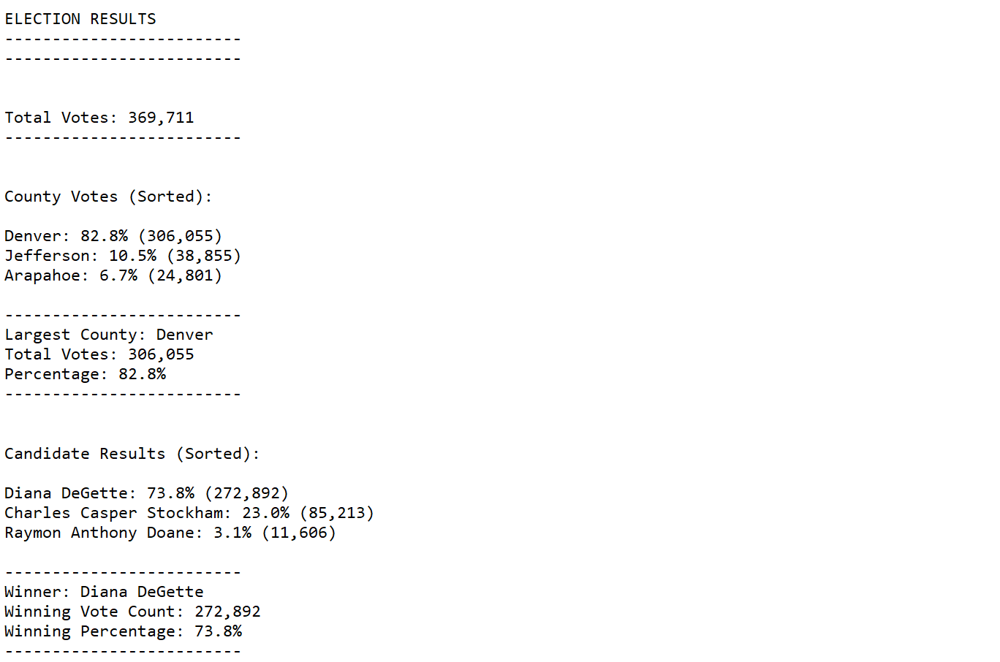

# Election analysis

- My new comment
- Another comment

## Project overview

The objective of this project is to obtain the results of a recent local congressional election for the Colorado Board of Elections, including:

1. Calculate the total number of votes cast.
2. Get a complete list of candidates who received votes.
3. Calculate the total number of votes each candidate received.
4. Calculate the percentage of votes each candidate won.
5. Determine the winner of the election based on popular vote.

## Resources

- Data Source: election_results.csv
- Software: Python 3.8.8, Visual Studio Code, 1.57.1

## Results

### Total votes casted

- There were 369,711 votes cast in the election.

### Results by candidate

- The **winner of the election is Diana DeGette** who received the 73.8% of the votes.
- The results by candidate are shown in the following table:

| Candidate| % of the votes | Number of votes |
|---|---|---|
| Diana DeGette | 73.8% | 272,892 |
| Charles Casper Stockham | 23.0% | 85,213 |
| Raymon Anthony Doane | 3.1% | 11,606 |

### Results by county

- Denver is the conty with the highest turn out acounting with 82% of the votes.
- Results by County:

| County | % of the votes | Number of votes |
|---|---|---|
| Denver | 82.8% | 306,055 |
| Jefferson | 10.5% | 38,855 |
| Arapahoe | 6.7% | 24,801 |

## Election Audit Summary

- This python code is designed to obtain the results of one elected seat or position.
- The result of the script PyPoll_Challenge_plus.py delivers Candidate and County results in descending order, this makes easier to identify the winning and trailing candidates:



Code used to sort counties:

```Python

    ### Plus order counties dictionary:
    sorted_county_votes = sorted(county_votes.items(),key=lambda x:x[1], reverse=True)

```

Code used to sort candidates:

```Python

    ### Plus order counties dictionary:
    sorted_candidate_votes = sorted(candidate_votes.items(),key=lambda x:x[1], reverse=True)

```

- This script could be used, with some modifications to calculate the results of many elections:
  - The loops, lists, and dictionaries to calculate candidate and counties results could be used to obtain the total votes by Congressional District.
  - The results could be recorded in one file or generate a file by Congressional District
  - In order to design the solution the client should define also if the source election results (votes) will be delivered in one global file or in separate files.

## Challenge summary

- The most challenging part of this script was formatting numbers and sorting a dictionary that was circumvent using a list of tuples.
